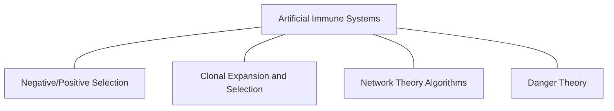

# AISP Architecture

AISP (**A**rtificial **I**mmune **S**ystems **P**ackage) is package dedicated to implementing algorithms
inspired by the immune system of vertebrates. This documentation focuses on the project architecture, aiming to
facilitate contributions and maintenance.  
The package structure is modular, with a clear separation between algorithms families and support modules for
component reuse across algorithms.

## Module organization

The package hierarchy is divided into 3 main cores: base, utils and algorithm families.  
The base core concentrates on immunological abstractions and modeling, serving as the foundation for the algorithms.  
Meanwhile, utils gathers functions that assist in implementing algorithms while avoiding code redundancy.

The algorithm families core group different immune system metaphors that define them.

In aisp, these families are organized into following modules:

- Danger Theory Algorithms (DTA) - Planned for future versions
- Clonal Selection Algorithms (CSA)
- Immune Network Algorithms (INA)
- Negative Selection Algorithms (NSA)

### Module details

#### Package core (`aisp.base`)  
The base module is the foundation of the package, divided into:
1. `base.core`: Contains abstract classes that implement parameter management and core logic for compatibility.
   - `Base` (Private): Abstract class extended by the other **base** classes listed below.
   - `BaseClassifier`: Abstract class for classification algorithms.
   - `BaseClusterer`: Abstract class for clustering algorithms.
   - `BaseOptimizer`: Abstract class for optimization algorithms.
2. `base.immune`: Defines cells and process from the immune inspired domain.
   - `cell`: Representations of immune system cells and antibodies.
   - `mutation`: Cell mutation functions.
   - `population`: Creation of immune cell populations.
#### Utilities (`aisp.utils`)  
Support module with reusable helper functions across the package.
#### Algorithm families
The implementations of immune inspired algorithms in **aisp** are organized into families, based on the taxonomy
presented in Brabazon et al. [^1]

**Source: Adapted from Brabazon et al. [^1], Figure 16.1.**

Structure as follows:
 - `aisp.nsa`: Module with algorithms based on Negative Selection.
 - `aisp.csa`: Module with algorithms based on Clonal Selection.
 - `aisp.ina`: Module with algorithms based on immune network theory.
 - `aisp.dta`: Module with algorithms based on Danger Theory (**Ainda não implementado**).

## References

[^1]: BRABAZON, Anthony; O'NEILL, Michael; MCGARRAGHY, Seán. Natural Computing
    Algorithms. [S. l.]: Springer Berlin Heidelberg, 2015. DOI 10.1007/978-3-662-43631-8.
    Available at: https://dx.doi.org/10.1007/978-3-662-43631-8.
