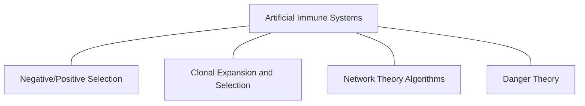

# Arquitetura do AISP

O AISP (**A**rtificial **I**mmune **S**ystems **P**ackage) é um pacote dedicado à implementação de algoritmos
inspirados no sistema imunológico dos vertebrados. Essa documentação foca na arquitetura do projeto, com o intuito de
auxiliar contribuições e manutenção.  
A estrutura do pacote é modular, com separação clara entre as famílias de algoritmos e módulos de suporte para
reutilização de componente pelos algoritmos.

## Organização dos módulos

A hierarquia do pacote esta divida em 3 núcleos principais: base, utils e famílias de algoritmos.  
O núcleo base concentra nas abstrações e modelagens imunológicas, servindo como a fundação para os algoritmos.
Já utils reúne funções que auxiliam na implementação dos algoritmos evitando redundância de código.

O núcleo das famílias de algoritmos agrupa as diferentes metáforas dos sistemas imunológicos que os define.

No aisp, essas famílias estão organizadas nos seguintes módulos:

- Danger Theory Algorithms (DTA) - Previsto para versões futuras do pacote
- Clonal Selection Algorithms (CSA)
- Immune Network Algorithms (INA)
- Negative Selection Algorithms (NSA)

### Detalhamento dos módulos

#### Nucleo do pacote (`aisp.base`)  
O módulo base é a fundação do pacote, dividido em:
1. `base.core`: Contem as classes abstratas que implementa o gerenciamento dos parâmetros e a lógica base para compatibilidade.
   - `Base` (Privada): Classe abstrata estendida pelas demais classes **base** listadas abaixo.
   - `BaseClassifier`: Classe abstrata para algoritmos de classificação.
   - `BaseClusterer`: Classe abstrata para algoritmos de clusterização.
   - `BaseOptimizer`: Classe abstrata para algoritmos de otimização.
2. `base.immune`: Define as células e processos do domínio imunoinspirados.
   - `cell`: Representações de células e anticorpos do sistema imunológico.
   - `mutation`: Funções de mutação das célular.
   - `population`: Criação de populações de células imunes.
#### Utilitários (`aisp.utils`)  
Módulo de suporte com funções auxiliares reutilizáveis no pacote.
#### Famílias de algoritmos  
As implementações dos algoritmos imunoinspirados no **aisp** estão organizadas em famílias, baseada na taxonomia
apresentada em Brabazon et al. [^1]

**Fonte: Adaptado de Brabazon et al. [^1], Figura 16.1.**

Sendo estruturadas da seguinte forma:
 - `aisp.nsa`: Módulo com algoritmos baseados na seleção negativa.
 - `aisp.csa`: Módulo com algoritmos baseados na seleção clonal.
 - `aisp.ina`: Módulo com algoritmos baseados na teoria da rede imunológica.
 - `aisp.dta`: Módulo com algoritmos baseados na teoria do perigo (**Ainda não implementado**).

## Referências

[^1]: BRABAZON, Anthony; O'NEILL, Michael; MCGARRAGHY, Seán. Natural Computing
    Algorithms. [S. l.]: Springer Berlin Heidelberg, 2015. DOI 10.1007/978-3-662-43631-8.
    Disponível em: https://dx.doi.org/10.1007/978-3-662-43631-8.
