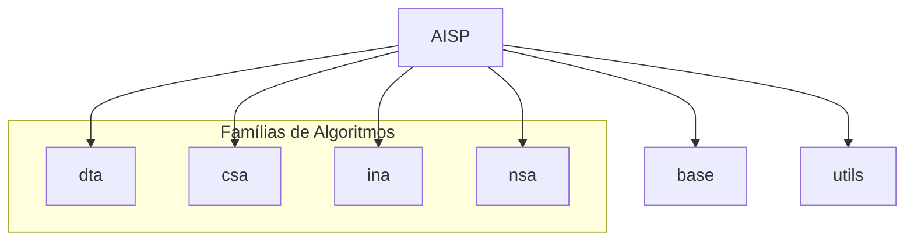

# Arquitetura do AISP

O AISP (**A**rtificial **I**mmune **S**ystems **P**ackage) é um pacote dedicado à implementação de algoritmos
inspirados no sistema imunológico dos vertebrados. Essa documentação foca na arquitetura do projeto, com o intuito de
auxiliar contribuições e manutenção.  
A estrutura do pacote é modular, com separação clara entre as famílias de algoritmos e modulos de suporte para
reutilização de componente pelos algoritmos.

## Organização dos modulos

A hierarquia do pacote esta divida em 3 núcleos principais: base, utils e famílias de algoritmos.  
O núcleo base concentra nas abstrações e modelagens imunológicas, servindo como a fundação para os algoritmos.
Já utils reúne funções que auxiliam na implementação dos algoritmos evitando redundância de código.

O núcleo das famílias de algoritmos agrupa os conforme as metáforas dos sistemas imunológicos que os define.

As principais famílias de algoritmos são:

- Danger Theory Algorithms (DTA) - Previsto para versões futuras do pacote
- Clonal Selection Algorithms (CSA)
- Immune Network Algorithms (INA)
- Negative Selection Algorithms (NSA)

Representação visual:

